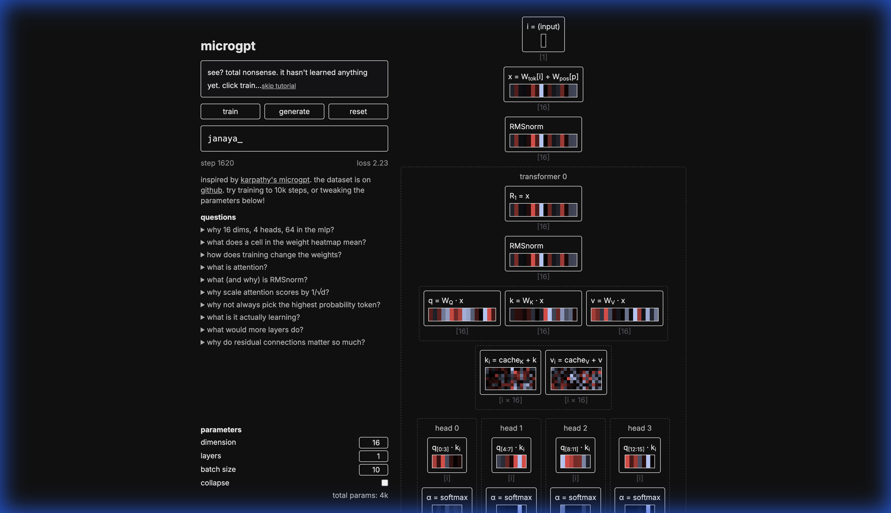

# microgpt

> a tiny visualization of a GPT model, running locally in the browser.

**[live demo](https://microgpt.boratto.ca)**



## developemnt

built with tensorflow.js (and react/tailwind/vite). see `src/App.tsx` (entry point/ui), `src/microgpt.ts` (the model), and `src/explain.tsx` (explanations), `src/arch.tsx` (the architecture visualization)

```bash
# git clone
gh repo clone b44ken/microgpt && cd microgpt
# then the server
npm install && npm run dev
```